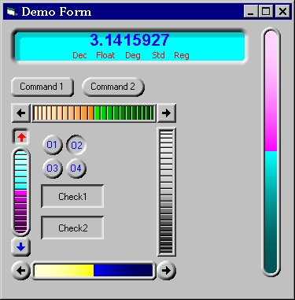



## Self\-drawn shaped bevelled controls

### Description

Three self-drawn bevelled controls, no bitmaps used to create the full 3D effect. BUTTON control usable as command, option or check button. NUMERIC DISPLAY control with built-in interchangeable Base display, Display format, Angle Units and others, suitable for use as a calculator display. WHEEL control, this is a vast update of an ealier submission, may be used in place of scrollers, sliders, up-down control and progress-bar. This a beta version only, Property Pages have not yet been constructed and documentation needs to be expanded. Whether you like, dislike or hate this, please VOTE and reply with CONSTRUCTIVE comments.
 
### More Info
 

             |
---                |---
**Submitted On**   |2004-06-02 23:52:46
**By**             |[Nero](https://github.com/Planet-Source-Code/PSCIndex/blob/master/ByAuthor/nero.md)
**Level**          |Advanced
**User Rating**    |5.0 (45 globes from 9 users)
**Compatibility**  |VB 5\.0, VB 6\.0
**Category**       |[Custom Controls/ Forms/  Menus](https://github.com/Planet-Source-Code/PSCIndex/blob/master/ByCategory/custom-controls-forms-menus__1-4.md)
**World**          |[Visual Basic](https://github.com/Planet-Source-Code/PSCIndex/blob/master/ByWorld/visual-basic.md)
**Archive File**   |[Self\-drawn175377642004\.zip](https://github.com/Planet-Source-Code/nero-self-drawn-shaped-bevelled-controls__1-54183/archive/master.zip)

### API Declarations

See Code.

